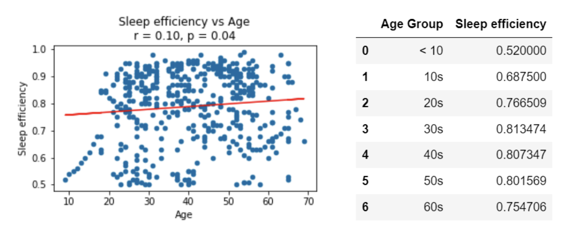
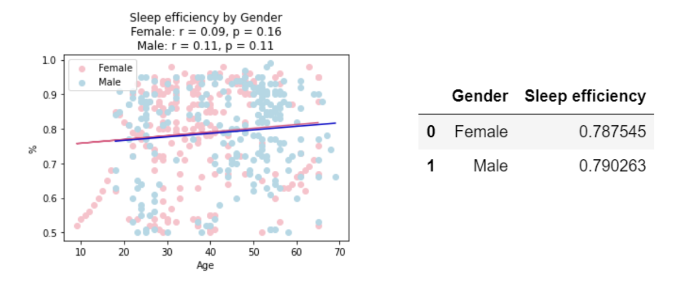
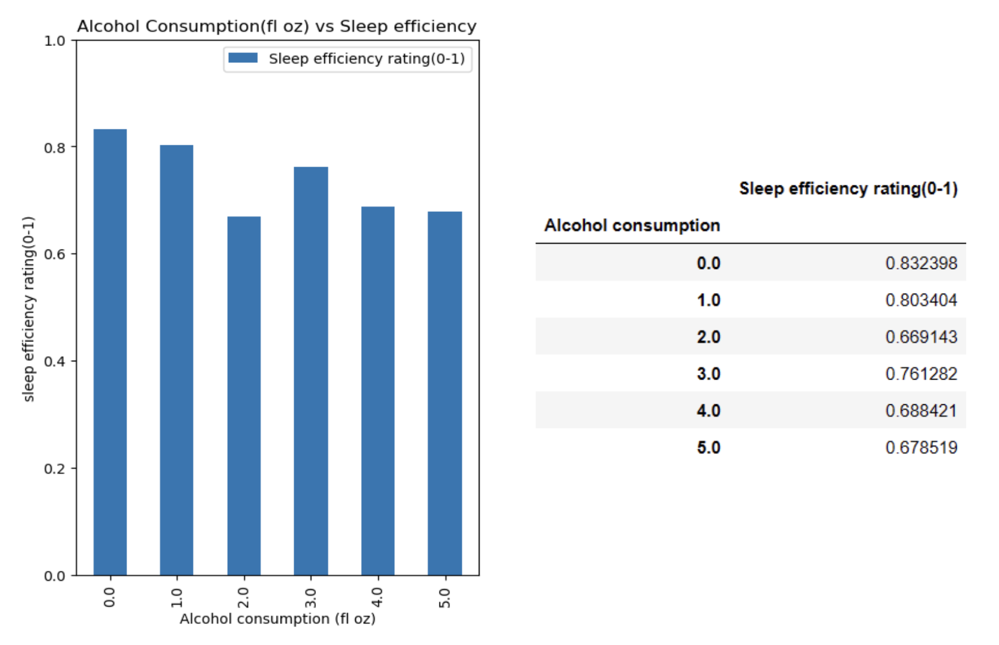
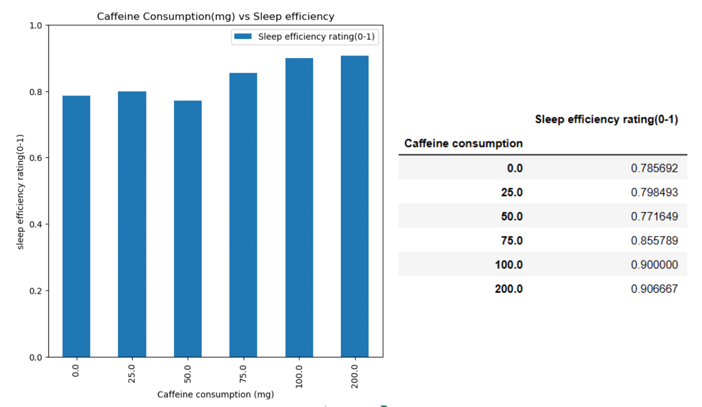
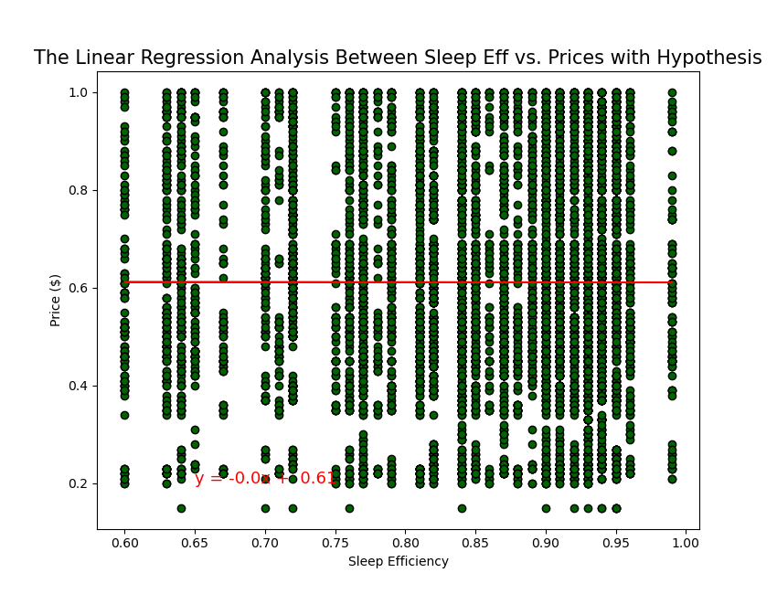
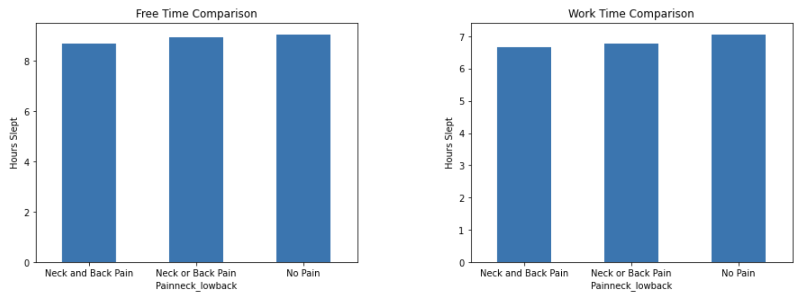
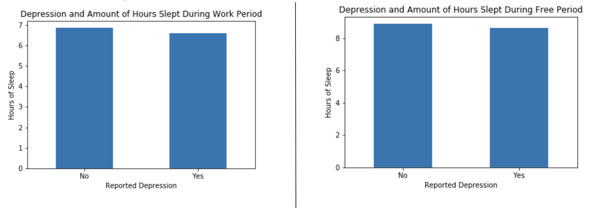
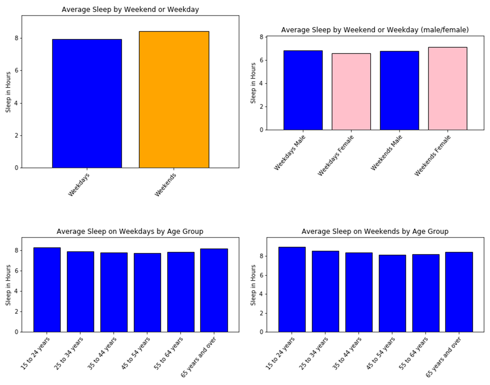

# Exploratory Analysis of Sleep Data Final Analysis Report

### Description
A basic analysis on sleep efficiency based on data from various sources.

### Info / Credits

- Analysis and Final Analysis Report by 
    * `Jenna Barkley` 
    * `Giulio Chiappolini` 
    * `Muhammad Haider` 
    * `Skyler Khalachyan` 
    * `Sarah Kim` 
    * `Beethoven Sabar` 

- `REPO:` https://github.com/jbarkle/Exploratory-Analysis-of-Sleep-Data

- `Analysis Last Updated:` April 20th, 2023

- `Report Last Updated:` April 20th, 2023

*Disclaimer: This is in no way a form of an official report on sleep efficiency.*

### Data Sources
|Name|Type|Description|Website|
|---|---|---|---|
|Sleep Efficiency Dataset|CSV|A study of sleep efficiency, and sleep patterns.|https://www.kaggle.com/datasets/equilibriumm/sleep-efficiency|
|Fitness tracker data |CSV|Steps, distance, calories, deep sleep, fat rate, bone mass, and so on.|https://www.kaggle.com/datasets/damirgadylyaev/more-than-4-years-of-steps-and-sleep-data-mi-band|
|Fruit and Vegetable Prices in UK|CSV|Series of weekly average wholesale fruit and vegetable market prices in UK.|https://www.kaggle.com/datasets/datota/fruit-and-vegatable-prices-in-uk-2017-2022|
|Sleepless in America?|CSV|The American Time Use Survey tracks how much Americans sleep by gender and age.|https://data.world/makeovermonday/2019w23|
|Natural light exposure, sleep and depression among day workers and shiftworkers at Arctic and Equatorial latitudes|CSV|Study aimed to investigate the relationship between individual natural light exposure, sleep need, and depression at two latitudes.|https://datadryad.org/stash/dataset/doi:10.5061/dryad.73f69|
|Jenna's Personal FitBit Tracker Data|CSV|Sleep data tracked and exported from personal device; 2019-2020.|N/A|

## Introduction

A good night’s sleep is crucial for maintaining both physical and mental health. Many people experience difficulties with sleep due to a variety of factors. This project aims to address this problem by analyzing the relationship between different factors versus sleep metrics to identify significant factors that affect sleep quality. In doing so, we hope to help people make more informed decisions and choices to improve not only their quality of sleep but their overall quality of life. 

## Hypothesis 1a - 1c Analysis

Demographic factors, such as age and gender, and lifestyle factors, such as alcohol consumption, caffeine consumption , and nutrition, have a significant effect on sleep efficiency. 

Approach: Group data by effects. For example, grouping data by age, gender, drinking/not drinking, etc. Comparing and finding data with data visualization. Running t-tests to determine statistical significance and determining correlation coefficients. 

### **Hoa:** Age/Gender have **NO** effect on sleep efficiency

### **Haa:** Age/Gender have an effect on sleep efficiency

**Demographic Factors:**

-Age showed moderate statistical significance against sleep efficiency with a P-value of 0.04. The resulting r-value of 0.10 indicates a weak positive correlation, sleep efficiency increases slightly as you age. 

-The P-values of both female (0.16) and male (0.11) exceed the 0.05 significance level which suggests that the observed differences may be due to chance.  Gender is not statistically significant against sleep efficiency.

### **Hob:** Food prices do **NOT** significantly affect your sleep efficiency

### **Hab:** When food prices get higher (price is greater than $1 per unit), sleep efficiency is lower (sleep efficiency less than or equal to 0)

### **Hoc:** Alcohol/Caffeine have **NO** effect on sleep efficiency

### **Hac:** Alcohol/Caffeine have an effect on sleep efficiency

**Lifestyle Factors:**

-Alcohol consumption showed statistical significance against sleep efficiency with a P-value of 9.5 x (10^-13). The resulting r-value of 0.16 indicates a weak positive correlation. 

-Caffeine consumption showed no statistical significance against sleep efficiency with a P-value of .60. The resulting r-value of 0.005 indicates almost no correlation.

-Food prices showed no significance against sleep efficiency with a P-value of 0.0. The resulting r-value of 0.0 indicates no correlation.  

**Results:**

-Insufficient statistical evidence → failed to reject our null hypothesis. We cannot say that Demographic factors, such as age and gender, and lifestyle factors, such as alcohol consumption, caffeine consumption , and nutrition, do not have a significant effect on sleep efficiency.

## Hypothesis 2 Analysis

Spinal pain and mental health has an impact on the duration of sleep hours.

### **Ho:** Either spinal pain or depression has **NO** impact on duration of sleep hours

### **Ha:** Spinal pain and depression have an impact on duration of sleep hours

**Work and Free Day Pain vs Hours Slept:**

-Because our p-values for pain vs hours slept for both work and free days (p-value=1.3194113350025375e-06 for work days & p-value=0.0005112937517179515 for free days) are less than .05, our measure of confidence is high and we can reject our null hypothesis.

**Work and Free Day Depression vs Hours Slept:**

-Because the p-values for people with depression vs those without depression (p-value=0.07496161897286625 for work days &  p-value=0.13129521932015384 for free days) is greater than .05, we cannot reject the null hypothesis that depression has a significant impact on the amount of sleep people get. 

**Results:**

-Because we rejected the null hypothesis for pain vs hours slept, we also reject our overall null hypothesis.

## Hypothesis 3 Analysis

If sleep duration is related to the impacts of the 9-5 work week, sleep duration should increase during the weekends.

### **Ho:** work week has **NO** impact on sleep duration

### **Ha:** work week has negative impact on amount of sleep; non-work week has positive impact on sleep

**Sleep Duration on Weekdays versus Weekends**

-Although the bar charts show that there is an increase in sleep duration (including by gender and by age group) on the weekend versus the weekday, there is minimal statistical significance between an individual’s work week and the sleep duration on the non-work week or day (i.e. holiday)

**Results:**
-P-value=0.6895402640949051

-We cannot reject the null hypothesis.
